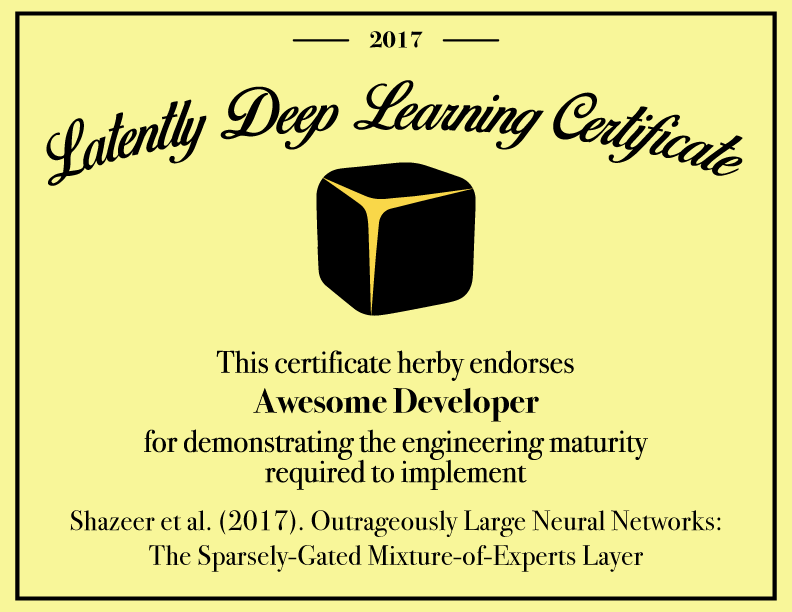

Welcome to the LDLC! This is a joint effort by Latently, Bitfusion, IBM Cloud and The Neuroscience Gateway to democratize progress in deep learning. To join, send your resume to dlc@latent.ly or keep reading.

More specifically, through the LDLC we plan to achieve the following objectives:

* Publicly implement all scientific papers and patents in artificial intelligence and machine learning while developing a common code base that makes it easier to implement and develop new advances.
* As a community, discover, to the greatest extent possible, who owns what aspects of implementations so as to perform proper credit assignment. In the case where IP is discovered to be owned by another entity, seek to establish permission to use their IP.
* Provide access to state of the art hardware for AI/ML to anyone interested in learning and earning a certificate. This currently consists of a large cluster of nVidia P100s on IBM Cloud and millions of core hours on the Stampede and Comet supercomputers.
* Create a community of engineers, researchers and mentors dedicated to staying up-to-date with and advancing the state of the art, here on GitHub and also on Slack: http://latently.slack.com
* Issue certificates endorsing the engineering maturity required to implement, replicate or write a scientific paper on our platforms. An unlimited number of certificates may be earned.
* Explore novel methods of composing implementations into enterprise solutions and compensating developers for the code they have written.

Developers own their own code and also issue a limited license to Latently that allows us to explore novel schemes for compensating developers for the code they write. Latently *does not* own the code, but has a license to sell it on your behalf according to terms (novel compensation schemes) you agree to on our marketplace.

# Getting started

## Professional track

To get started simply fork the LDLC and implement a paper that we don't yet have an implementation of, or significantly optimize or substantially refactor and improve an existing implementation. Before pull requests can be merged and a certificate issued, code must pass code review and you must sign a contributor agreement. You may use your own computing resources to write code, but don't write code at work or school unless they are willing to assign all rights to the code to you. When writing code *do not* look at other existing implementations, otherwise the author of those implementations may own your code.

For a more personalized experience send your resume to dlc@latent.ly to set up a meeting with one of our deep learning experts. We will evaluate where you are in your engineering career and help you pick a paper that is suitable for your skill level. You can gain access to ongoing advice, evaluation of your conceptual progress and pointers to information that you may want to study based on your progress.

## Research track

More advanced candidates may use our hardware and mentorship resources to conduct original research and to publish it. 

For those who are more business oriented we will work with you to design a novel deep learning architecture using state-of-the-art methods on our GPU cluster.

For those who are more academically oriented you may use our resources on the Comet and Stampede supercomputer (currently #20 in the world) to publish a model built using either [*emergent*](http://grey.colorado.edu/emergent), NEURON, Genesis3, Moose, NEST, PyNN, Brian or Freesurfer. At this time we can only provide mentorship for *emergent*. Note that research done on The Neuroscience Gateway must advance the state of the art in computational neuroscience, computational cognitive neuroscience, cognitive computational neuroscience or a related field. The code will be licensed under the GPLv2 and will not be sold on our marketplace.

# For Enterprises

Please send all requests regarding projects, requests for implementations of papers or license purchases to brian@latent.ly

# About Latently

Latently is a deep learning startup out of Boulder, Co, founded by Brian Mingus. We have substantial expertise in deep learning, software engineering and free culture. We first tested the LDLC in a successful pilot phase and are now launching it to the public. Latently is committed to first experimenting with and then delivering novel mechanisms for democratizing technological progress and reducing inequality and we invite you to help.
